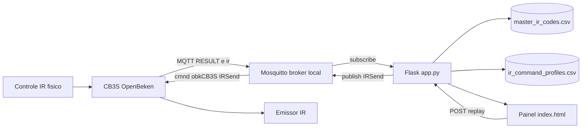

# Arquitetura do Sistema - Sitezinho Local IR Sniffing

## 1. Visao geral
Este documento descreve a arquitetura de software para capturar, processar, armazenar e retransmitir sinais de infravermelho com OpenBeken, MQTT e Flask.

## 2. Diagrama de arquitetura

## 3. Fluxo de dados

### 3.1 Captura
1. O CB3S recebe o sinal de um controle fisico.
2. O OpenBeken publica em topicos MQTT como `stat/obkCB3S/RESULT` e `obkCB3S/ir`.
3. O backend em `server/app.py` recebe e parseia os eventos.

### 3.2 Processamento
1. Filtro de ruido para frames nulos e formatos ambiguos.
2. Normalizacao de hexadecimal e bits.
3. Geracao de assinatura para agrupamento.
4. Classificacao de classe de captura, incluindo sinal de ar-condicionado.
5. Preparacao de payload de replay para `IRSend`.

### 3.3 Armazenamento
Persistencia principal em CSV local:
1. `server/data/master_ir_codes.csv` com historico de capturas.
2. `server/data/ir_command_profiles.csv` com perfis consolidados.

Persistencia complementar recomendada:
1. Exportacao JSON de snapshot para auditoria e backup offline.

## 4. Componentes principais
1. Backend Flask em `server/app.py` com ingestao MQTT, stream SSE, monitor de eventos e endpoints de replay.
2. Frontend em `server/templates/index.html` com painel de captura, filtros e controles de replay.
3. Broker MQTT local via Docker Compose em `docker-compose.yml`.

## 5. Durabilidade de dados
1. CSV ja fica fora de container quando o backend roda localmente.
2. O broker Mosquitto foi configurado com volume local em `runtime/mosquitto/data` e `runtime/mosquitto/log`.
3. Para backup operacional, usar exportacao JSON periodica.

## 6. Guias relacionados
1. Operacao de rede e persistencia: `docs/OPERACAO_REDE_PERSISTENCIA.md`.
2. Baterias de testes ponta a ponta: `docs/PLANO_TESTES_SISTEMA.md`.
