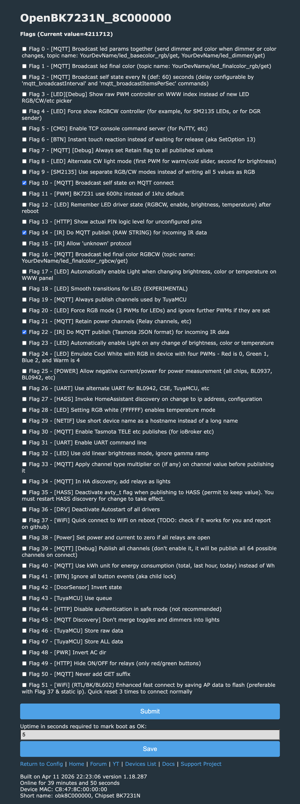
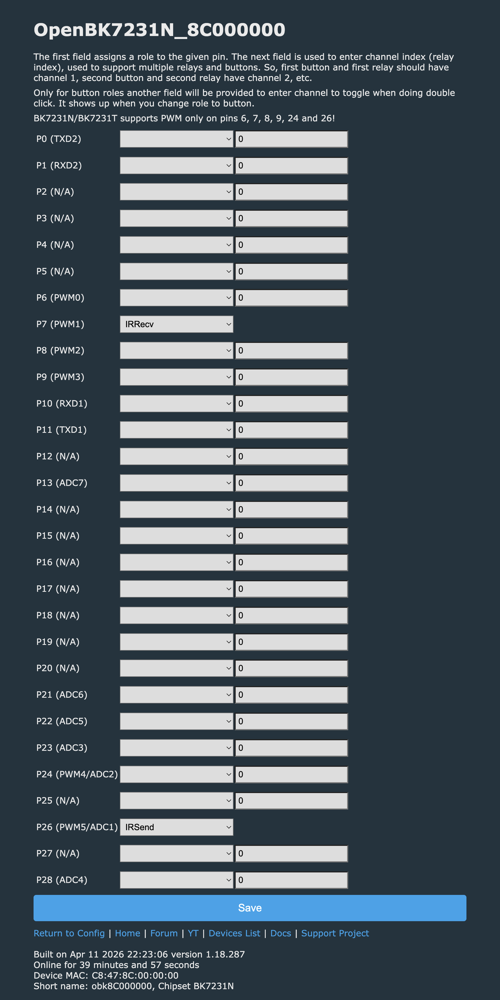

# Diario de Configuracao OpenBeken (Passo a Passo)

## Estado atual rapido
1. Firmware OpenBeken gravado com sucesso.
2. Foi feito refresh completo da configuracao (reflash em 0x0).
3. A configuracao anterior de Wi-Fi/senha web foi apagada.
4. A interface web voltou a abrir apos reset (prints 15 e 16 salvos).
5. O IP antigo 192.168.0.252 nao deve mais ser considerado fixo.
6. MAC atual exibido no painel: C8:47:8C:00:00:00.
7. IP atual encontrado por ARP (MAC match): 192.168.0.130.

## Onde salvar prints
Pasta oficial:
- docs/openbeken/prints/

Padrao de nome de arquivo:
- 01_wifi_scan.png
- 02_wifi_submit.png
- 03_dhcp_ip_192.168.0.252.png
- 04_mqtt_config.png
- 05_pins_ir_rx.png
- 06_pins_ir_tx.png
- 07_teste_ir_capture.png
- 08_teste_ir_send.png
- 15_home_openbeken_pos_reset.png
- 16_config_menu_openbeken_pos_reset.png
- 18_pins_cfg_p7_irrecv_p26_irsend.png
- 19_flags_ativas_cfg_generic.png
- 20_pins_cfg_p7_irrecv_nopup_runtime.png
- 21_led_ir_blink_ok.png

## Fluxo de replicacao (checklist)
- [x] 1. Flash do OpenBeken concluido.
- [x] 2. Acesso inicial ao painel web (AP do OpenBeken).
- [x] 3. Configuracao de SSID e senha da rede local.
- [x] 4. Descoberta de IP na rede local.
- [x] 5. Refresh completo para recuperar acesso (senha web).
- [x] 6. Reconectar no AP padrao do OpenBeken.
- [x] 7. Reconfigurar Wi-Fi da rede local.
- [x] 8. Configurar MQTT (host, porta, topico base).
- [x] 9. Confirmar status online via broker.
- [x] 10. Mapear pino IR RX.
- [x] 11. Mapear pino IR TX.
- [x] 12. Teste de captura IR.
- [x] 13. Teste de emissao IR.
- [x] 14. Integracao com backend local.

## Lista unica de proximos passos (faltantes)

### Fase A - Fechar estabilidade de rede
- [ ] A1. Reservar IP fixo no roteador para MAC C8:47:8C:00:00:00.
- [ ] A2. Validar reboot duplo e confirmar que volta no mesmo IP.
- [ ] A3. Salvar print da pagina de DHCP/reserva no roteador.

### Fase B - Mapeamento de hardware IR no OpenBeken
- [x] B1. Identificar pino fisico ligado ao receptor IR (IR RX).
- [x] B2. Configurar papel de pino para IR RX e salvar print (18_pins_cfg_p7_irrecv_p26_irsend.png).
- [x] B3. Identificar pino fisico ligado ao emissor IR (IR LED/TX).
- [x] B4. Configurar papel de pino para IR TX e salvar print (18_pins_cfg_p7_irrecv_p26_irsend.png).

### Fase C - Testes funcionais de IR
- [x] C1. Fazer captura de um controle real e validar protocolo/hex/bits no painel.
- [x] C2. Confirmar publicacao MQTT do evento de IR capturado.
- [ ] C3. Salvar print da captura (07_teste_ir_capture.png).
- [x] C4. Enviar comando IR pelo painel/script e validar atuacao no alvo local (LED IR).
- [x] C5. Salvar print de emissao (21_led_ir_blink_ok.png).

### Fase D - Integracao backend (projeto local)
- [x] D1. Garantir recebimento de mensagens reais do OpenBeken no backend Flask.
- [x] D2. Confirmar escrita no CSV com multiplas capturas reais (nao so teste sintetico).
- [ ] D3. Validar visualizacao no painel web local (porta 5050).
- [ ] D4. Validar fluxo de envio de comando IR via MQTT a partir do backend.

### Fase E - Fechamento e entrega tecnica
- [ ] E1. Revisar e completar relatorio final com evidencias de ponta a ponta.
- [ ] E2. Atualizar diario com data, print e resultado de cada fase acima.
- [ ] E3. Gerar checklist final de reproducao em ambiente limpo.

### Fase F - Higienizacao para push
- [x] F1. Consolidar evidencias de configuracao e teste de LED IR em docs/openbeken/prints.
- [x] F2. Mover documentos de requisitos para pasta padrao em docs/requisitos.
- [x] F3. Definir politica de exclusao de artefatos gerados no .gitignore.
- [x] F4. Atualizar lista unica de TODOs para proxima rodada tecnica.

## Log por etapa

## Etapa 01 - Wi-Fi
Data: 2026-04-13
Descricao:
1. Entrou em Config -> WiFi.
2. Escaneou redes.
3. Preencheu SSID e senha.
4. Clicou em Submit.
Resultado:
1. AP deixou de aparecer apos reboot.
2. Dispositivo passou para modo station na rede local.
3. IP encontrado via ARP pelo MAC: 192.168.0.252.
Prints recomendados:
1. docs/openbeken/prints/01_wifi_scan.png
2. docs/openbeken/prints/02_wifi_submit.png
3. docs/openbeken/prints/03_dhcp_ip_192.168.0.252.png

## Proxima etapa (agora)
Objetivo:
1. Reconectar no AP padrao do OpenBeken e abrir 192.168.4.1.
2. Reconfigurar SSID/senha da rede local.
3. Confirmar novo IP no roteador/ARP.
4. So depois configurar MQTT.
Campos sugeridos:
1. Host: 172.24.47.235
2. Porta: 1883
3. Client/Short name: obkE52E8DDE
Validacao:
1. Verificar se publica status de conectado no broker.
2. Guardar print da tela de MQTT e do log de mensagens.

## Etapa 02 - Refresh completo (recuperacao de acesso)
Data: 2026-04-13
Descricao:
1. Tentativa de refresh com uartprogram (falhou por instabilidade de link).
2. Refresh concluido com ltchiptool em modo forcado:
	- arquivo: OpenBK7231N_QIO_1.18.287.bin
	- start offset: 0x0
	- resultado: 100% concluido
3. Apos refresh, o IP antigo de station (192.168.0.252) parou de responder.
Resultado:
1. Configuracao anterior foi descartada.
2. Esperado: modulo volta para AP inicial (acesso via 192.168.4.1).
Prints recomendados:
1. docs/openbeken/prints/09_refresh_write_100.png
2. docs/openbeken/prints/10_ap_openbeken_pos_refresh.png

## Etapa 03 - Diagnostico de acesso web apos refresh
Data: 2026-04-13
Descricao:
1. AP OpenBeken nao apareceu no scan local.
2. Dispositivo respondeu em 192.168.0.252 (ping OK, MAC confere).
3. Porta 80 aberta.
4. Requisicao HTTP retornou 401 Unauthorized com realm OpenBeken HTTP Server.
Resultado:
1. Dispositivo esta em modo station na rede local.
2. Interface web esta protegida por autenticacao Basic ativa.
3. Acesso deve ser feito em http://192.168.0.252 com usuario admin e senha correta.
Prints recomendados:
1. docs/openbeken/prints/11_ping_192.168.0.252.png
2. docs/openbeken/prints/12_http_401_openbeken.png

## Etapa 04 - Reset de credenciais por imagem combinada
Data: 2026-04-13
Descricao:
1. Descoberto no dump antigo que existe particao de storage em 0x1EE000 (32 KiB).
2. Tentativas de apagar somente a particao de storage falharam por instabilidade de escrita setorial.
3. Foi gerada imagem combinada OpenBK7231N_QIO_1.18.287_wipecfg.bin com preenchimento em FF ate 0x1F6000.
4. Escrita forçada em 0x0, sem skip, concluida 100%.
Resultado:
1. Escrita concluida em aproximadamente 193 s.
2. IP antigo (192.168.0.252) deixou de responder.
3. Proximo passo e validar retorno do AP OpenBeken com power-cycle e scan de redes.
Prints recomendados:
1. docs/openbeken/prints/13_wipecfg_flash_100.png
2. docs/openbeken/prints/14_ping_old_ip_down.png

## Etapa 05 - Acesso web recuperado (prints salvos)
Data: 2026-04-13
Descricao:
1. A interface principal do OpenBeken voltou a abrir apos reset.
2. Tela de Config tambem abriu normalmente.
3. Prints novos foram arquivados na pasta oficial.
Resultado:
1. Recuperacao de acesso concluida.
2. Proximo passo operacional: reconfigurar Wi-Fi e MQTT de forma controlada.
Prints salvos:
1. docs/openbeken/prints/15_home_openbeken_pos_reset.png
2. docs/openbeken/prints/16_config_menu_openbeken_pos_reset.png

## Etapa 06 - Redescoberta do IP em modo cliente
Data: 2026-04-13
Descricao:
1. Busca por MAC no ARP local usando prefixos C8:47:8C e 38:2C:E5.
2. Match encontrado em 192.168.0.130 para MAC C8:47:8C:00:00:00.
3. Ping para 192.168.0.130 respondeu normalmente.
4. HTTP GET retornou 401 (login ativo), confirmando endpoint web do OpenBeken.
Resultado:
1. Endereco de login recuperado: http://192.168.0.130

## Etapa 07 - Comparacao com tutorial oficial
Data: 2026-04-13
Fontes oficiais:
1. https://github.com/openshwprojects/OpenBK7231T_App/blob/main/docs/initialSetup.md
2. https://github.com/openshwprojects/OpenBK7231T_App/blob/main/FLASHING.md
3. https://github.com/openshwprojects/OpenBK7231T_App/blob/main/docs/safeMode.md
Resumo oficial:
1. Conectar no AP inicial, abrir 192.168.4.1 e configurar Wi-Fi.
2. Reiniciar e descobrir IP na pagina DHCP do roteador.
3. Usar safe mode por ciclos de energia quando necessario.
Diferenca no nosso caso:
1. O IP em modo cliente foi encontrado por ARP + MAC local, sem painel do roteador.
2. A confirmacao de endpoint foi feita por ping + HTTP 401.
3. Foi aplicado fluxo adicional de recuperacao por reflash controlado para limpar configuracao.
Resultado:
1. Fluxo pratico validado para ambiente sem acesso administrativo ao roteador.

## Etapa 08 - Backend local instalado e validado
Data: 2026-04-13
Descricao:
1. Dependencias Python instaladas no ambiente virtual: Flask, paho-mqtt, pandas, pyserial.
2. Broker MQTT local iniciado por Docker Compose (servico mosquitto na porta 1883).
3. Backend Flask iniciado com MQTT ativo e assinatura em +/RESULT e +/ir/get.
4. Porta padrao do backend ajustada para 5050 neste ambiente (evitar conflito com AirPlay do macOS na 5000).
5. Teste fim a fim executado: publish MQTT de payload IR e confirmacao de escrita no CSV.
Resultado:
1. Backend operacional em http://127.0.0.1:5050
2. Ingestao MQTT confirmada no arquivo server/data/master_ir_codes.csv.
3. OpenBeken segue acessivel em 192.168.0.130 (ping OK, HTTP 401).

## Etapa 09 - MQTT configurado no OpenBeken (submit)
Data: 2026-04-13
Descricao:
1. Tela de configuracao MQTT preenchida e submetida no painel web.
2. Print salvo na pasta oficial de documentacao.
3. Broker registrou cliente MQTT com topico base obkCB3S.
Resultado:
1. Configuracao MQTT aplicada com sucesso no dispositivo.
Print salvo:
1. docs/openbeken/prints/17_mqtt_config_submit.png

## Etapa 10 - Mapeamento reverso de hardware (IR)
Data: 2026-04-13
Descricao:
1. Regulacao de tensao confirmada com HL1117-3.3 (entrada 5V, saida 3V3, GND na referencia comum).
2. Receptor IR de 3 pinos identificado na placa (VCC, GND e sinal OUT).
3. Estagio de emissao IR identificado com componente marcado 22ES em encapsulamento SOT-23:
	- pino da direita (inferior): GND
	- pino superior (isolado): linha dos LEDs IR
	- pino restante: controle via rede resistiva
4. Rede de controle do 22ES:
	- resistor de 10k para GND (pull-down)
	- resistor de 100 ohm para via que segue para pino 26 do CB3S (label IRDA)
5. Conclusao tecnica: pino 26 do CB3S e candidato forte para IR TX (IRSend), pois aciona driver dedicado dos LEDs IR.
Resultado:
1. Pinout de TX praticamente fechado por hardware: P26 -> IRSend.
2. Pinout de RX ainda pendente de fechamento por continuidade do OUT do receptor ate GPIO do CB3S.

## Etapa 11 - Estado de rede durante testes de IR
Data: 2026-04-13
Descricao:
1. Durante testes de pinagem IR houve mudancas de rede (bridge/AP/firewall), com alternancia de IP do modulo.
2. Hostname observado: ircontrol-lasdpc (10.0.3.154) com conectividade oscilante.
3. MQTT alternou entre online/offline por timeout em alguns intervalos.
Resultado:
1. Testes de IR RX com resultados inconclusivos nesta janela por instabilidade de conectividade.
2. Proximo passo recomendado: estabilizar conectividade por 5 minutos continuos antes de nova rodada de captura IR.

## Etapa 12 - Configuracao de pinos apos estabilizacao de rede
Data: 2026-04-13
Descricao:
1. Modulo voltou a responder no hostname ircontrol-lasdpc com autenticacao web ativa.
2. Revisao da tela de pin config mostrou mapeamento provisoriamente em P24=IRRecv.
3. Com base no mapeamento reverso de hardware, foi aplicado ajuste final de TX:
	- P24 limpo (None)
	- P26 configurado como IRSend
4. Estado atual na configuracao: somente P26 ativo como IRSend.
Resultado:
1. Bloco de transmissao IR (TX) alinhado com o hardware levantado (linha IRDA no pino 26).
2. Bloco de recepcao IR (RX) permanece pendente de fechamento por continuidade do OUT do receptor.

## Etapa 13 - Fechamento do mapeamento RX por continuidade
Data: 2026-04-13
Descricao:
1. Receptor IR 3 pinos analisado fisicamente (vista frontal): P7, GND, 3V3.
2. Confirmacao de que o pino de sinal do receptor segue para o GPIO P7 do CB3S.
3. Com isso, pinout final inferido por hardware:
	- P7 -> IRRecv
	- P26 -> IRSend
Resultado:
1. Mapeamento de IR fechado por engenharia reversa de trilha (sem tentativa cega).
2. Proximo passo operacional: aplicar/confirmar os dois roles no painel e validar captura/emissao em MQTT.

## Etapa 14 - Analise do resistor em serie com VCC do receptor IR
Data: 2026-04-13
Descricao:
1. Foi identificado resistor pequeno em serie entre 3V3 e VCC do receptor IR.
2. Valor estimado em bancada: aproximadamente 100 ohm.
3. Queda de tensao medida no resistor: 22.7 mV (estado de idle).
4. Corrente estimada pelo receptor em idle:
	- I = V / R = 22.7 mV / 100 ohm = 0.227 mA
5. Interpretacao tecnica:
	- valor e compativel com consumo baixo em repouso de receptor IR.
	- resistor em serie ajuda a desacoplar ruido da linha 3V3 e limitar picos/espurios locais.
	- se houver capacitor proximo ao receptor, este resistor tambem compoe um filtro RC local de alimentacao.
Resultado:
1. Medicao faz sentido fisicamente e reforca que o bloco de receptor IR esta alimentado por 3V3 condicionada.
2. Esquematico reverso consolidado em arquivo dedicado para continuidade do projeto.

## Etapa 15 - Publicacao MQTT de IR (flags e topicos)
Data: 2026-04-13
Descricao:
1. Revisao da documentacao oficial e codigo-fonte do OpenBeken (drivers/flags/mqtt) para fechamento do caminho de telemetria IR.
2. Confirmado que o publish de IR depende de flags globais:
	- Flag 14: publica IR em formato RAW string.
	- Flag 22: publica IR em JSON estilo Tasmota (campo IrReceived).
3. Formatos observados no firmware:
	- RAW: topico principal ir (normalmente com sufixo /get), payload textual do driver.
	- JSON: topico RESULT (sem /get), payload com estrutura {"IrReceived":{"Protocol":"...","Bits":N,"Data":"0x..."}}.
4. Backend local ajustado para cobrir os topicos de IR mais provaveis:
	- +/RESULT
	- stat/+/RESULT
	- tele/+/RESULT
	- +/ir/get
	- +/ir
5. Parser do backend expandido para aceitar tambem payload RAW legado no formato IR_<PROTO> ...
Resultado:
1. A camada de ingestao deixa de depender de um unico formato/topico de publish.
2. Proxima validacao depende de janela de rede estavel e flags 14/22 ativas no modulo.

## Etapa 16 - Evidencia de flags ativas e pinagem final
Data: 2026-04-13
Descricao:
1. Print de configuracao de flags salvo com as flags de interesse ativas:
	- Flag 10: broadcast do estado no connect MQTT.
	- Flag 14: publish de IR em formato RAW string.
	- Flag 22: publish de IR em formato JSON estilo Tasmota.
2. Print da pinagem salvo com configuracao aplicada:
	- P7 -> IRRecv
	- P26 -> IRSend
3. Validacao teorica da pinagem: consistente com a engenharia reversa das trilhas (OUT do receptor em P7 e linha IRDA/driver 22ES em P26).
Resultado:
1. Estado de configuracao do OpenBeken documentado com evidencia visual.
2. Pinagem considerada correta em nivel teorico para prosseguir com os testes funcionais de captura e emissao.
Prints salvos:
1. docs/openbeken/prints/19_flags_ativas_cfg_generic.png
2. docs/openbeken/prints/18_pins_cfg_p7_irrecv_p26_irsend.png

Evidencias visuais:

## Etapa 17 - Teste de recepcao IR em runtime (MQTT)
Data: 2026-04-13
Descricao:
1. Listener MQTT aberto no broker local para os topicos do dispositivo (obkCB3S/#, stat/obkCB3S/#, tele/obkCB3S/#).
2. Confirmacao de conectividade e caminho de comando MQTT com publish de teste (obkCB3S/test/get hello).
3. Ajuste de captura aplicado para ampliar cobertura de protocolos:
	- Flag 15 ativada (Allow unknown protocol).
	- P7 alterado para IRRecv_nPup (P26 mantido em IRSend).
4. Apos reboot do modulo, nova janela de captura executada com pressionamento de controle remoto.
Resultado:
1. Recepcao IR confirmada no MQTT em topicos de runtime:
	- obkCB3S/ir/get
	- obkCB3S/RESULT
2. Foram observados eventos UNKNOWN com bits validos (ex.: 32) e dados hex diferentes de zero, indicando deteccao de pulsos IR.
3. Tambem houve grande quantidade de eventos de ruido/decodificacao nula (UNKNOWN 0x0, RC5 com bits 0), portanto a captura ainda precisa refinamento para estabilidade de decodificacao.
4. Conclusao operacional: o bloco RX esta funcional; proxima etapa e reduzir ruido e estabilizar protocolo/bit count util para gravacao no dataset.
Print salvo:
1. docs/openbeken/prints/20_pins_cfg_p7_irrecv_nopup_runtime.png

## Etapa 18 - Documentacao de protocolos IR (versao completa + for dummies)
Data: 2026-04-13
Descricao:
1. Foi criada uma documentacao tecnica completa de protocolos IR com foco em replicacao no laboratorio:
	- conceitos de codificacao (pulse distance, pulse width, biphase, pulse position)
	- parametros praticos dos protocolos prioritarios (NEC, RC5, RC6, SIRC, JVC, RECS-80, RCMM)
	- metodo de catalogacao de teclas e criterio de aceite por consistencia
2. Foi criada uma versao didatica "for dummies" para uso rapido por alunos e tecnicos sem contexto previo.
3. Foi adicionada base de referencias externas para aprofundamento em protocolos e troubleshooting.
4. O link de Reddit indicado pela equipe foi registrado como referencia contextual.
Resultado:
1. Projeto passa a ter duas camadas de documentacao:
	- camada aprofundada (engenharia)
	- camada operacional simplificada (replicacao rapida)
2. Equipe do laboratorio pode iniciar captura e classificacao de comandos sem depender de conhecimento tacito.
Arquivos criados:
1. docs/openbeken/PROTOCOLOS_IR_COMPLETO.md
2. docs/openbeken/PROTOCOLOS_IR_FOR_DUMMIES.md

## Etapa 19 - Diagnostico profundo de firmware IR e endurecimento do parser
Data: 2026-04-13
Descricao:
1. Revisao de codigo-fonte do OpenBeken no caminho `IRremoteESP8266` para identificar parametros reais de recepcao.
2. Confirmado suporte em runtime ao comando `IRParam [MinSize] [Noise Threshold]`, que ajusta:
	- threshold de mensagens unknown curtas
	- tolerancia percentual de casamento de pulsos
3. Confirmados valores padrao da stack de recepcao no codigo:
	- buffer de captura 1024
	- timeout de 90 ms
	- tolerancia padrao 25%
4. Ajuste aplicado no backend local (`server/app.py`) para reduzir falsos positivos de ingestao:
	- parser sensivel ao topico
	- prioridade para JSON `IrReceived` no `.../RESULT`
	- bloqueio de parse heuristico em topicos nao IR
	- filtro opcional para amostras nulas (`0x0`, `bits=0`)
5. Plano A/B formalizado para comparar configuracoes de `IRParam` com metrica objetiva de taxa util e taxa nula.
Resultado:
1. Diagnostico passou de tentativa empirica para procedimento controlado com parametros de firmware verificaveis.
2. Base de dados local ficou mais representativa da qualidade real de captura, com menor contaminacao por payload ambiguo.
Arquivo criado:
1. docs/openbeken/DIAGNOSTICO_IR_FIRMWARE_OBK.md

## Etapa 20 - Validacao de emissao no LED IR (sucesso)
Data: 2026-04-14
Descricao:
1. Comando `blink_ir` executado no Command Tool do OpenBeken.
2. A pagina retornou status `OK` para a execucao do comando.
3. O alias `blink_ir` utiliza o caminho de emissao por canal (`SetChannel 1 1`, `delay_ms 120`, `SetChannel 1 0`).
4. Foi salvo print de evidencia com o comando e retorno na tela.
Resultado:
1. Emissao IR validada em runtime no dispositivo para o alvo local (LED IR da placa).
2. Checklist de emissao atualizado como concluido.
Print salvo:
1. docs/openbeken/prints/21_led_ir_blink_ok.png

## Etapa 21 - Higienizacao de documentacao para push
Data: 2026-04-14
Descricao:
1. Pasta antiga `docummentation` foi encerrada.
2. PDFs de requisitos foram movidos para `docs/requisitos/`.
3. O `.gitignore` foi atualizado para evitar push de artefatos de runtime (CSV e logs de captura) e backups de firmware.
4. Lista de TODOs consolidada em arquivo dedicado para planejamento da proxima rodada.
Resultado:
1. Estrutura documental preparada para push inicial com menor ruido.
2. Evidencias de laboratorio e requisitos ficaram em local padronizado.

## Etapa 22 - Stack pronta para sessao AC (hoje)
Data: 2026-04-17
Descricao:
1. Broker MQTT local confirmado em execucao (`local-mosquitto`, porta 1883).
2. Backend Flask iniciado em `http://127.0.0.1:5050` com assinatura ativa dos topicos IR.
3. Sessao de captura AC iniciada em log dedicado:
	- `server/data/raw_runs/ac_capture_live_20260417_154105.log`
4. Teste de emissao por MQTT validado no canal:
	- `cmnd/obkCB3S/SetChannel` com payload `1 1` e `1 0`
	- retorno observado no broker: `obkCB3S/1/get 1` e `obkCB3S/1/get 0`
5. Script utilitario adicionado para resumo rapido da captura:
	- `scripts/summarize_ir_log.py`

Resultado:
1. Ambiente local pronto para rodada de captura de comandos AC em tempo real.
2. Pipeline de validacao acelerado com resumo automatico de ruido/protocolos/frames longos.

Proximo passo operacional imediato:
1. Com a captura ativa, pressionar sequencia fixa no controle AC (Power, Temp+, Temp-, Mode, Fan) e rodar o resumo do log ao final da janela.

## Etapa 23 - Recuperacao do acesso web e comando IRSend
Data: 2026-04-17
Descricao:
1. Hostname antigo `ircontrol-lasdpc` estava apontando para IP desatualizado (`10.0.3.154`).
2. Endereco ativo do modulo identificado por MAC `C8:47:8C:00:00:00`: `10.0.3.155`.
3. Ajuste de runtime aplicado no Command Tool:
	- `SetPinRole 26 IRSend`
	- `SetPinRole 7 IRRecv_nPup`
	- `Restart`
4. Apos reboot, comando `IRSend NEC-20DF-10EF-3` voltou a responder com `OK` e logs `Info:IR:IR send ...`.
5. Alias `blink_ir` recriado em runtime para chamar IRSend direto:
	- `alias blink_ir IRSend NEC-20DF-10EF-3`

Resultado:
1. Acesso ao OpenBeken restabelecido via IP direto.
2. Pipeline de emissao IR restabelecido no firmware em runtime.

Print salvo:
1. docs/openbeken/prints/22_irsend_ok_runtime.png
